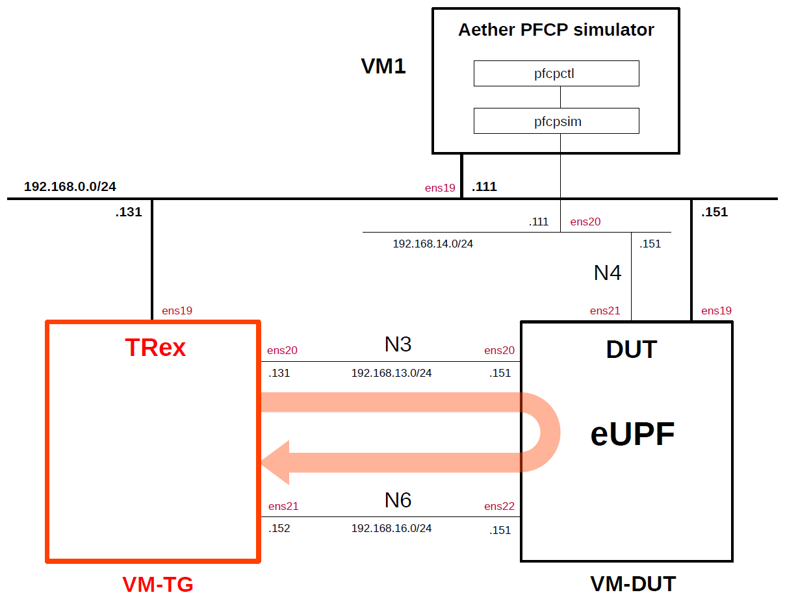

# Simple Measurement of eUPF(eBPF/XDP UPF) Performance
This describes simple performance measurements of [eUPF](https://github.com/edgecomllc/eupf)(eBPF/XDP UPF) by using the traffic generator [TRex](https://github.com/cisco-system-traffic-generator/trex-core) as the performance measurement tool and [Aether pfcpsim](https://github.com/omec-project/pfcpsim) as the PFCP simulator.
This was measured on the VMs on Proxmox VE.
For other measurement results, please see [Performance Measurement](https://github.com/s5uishida/sample_config_misc_for_mobile_network#performance_measurement).

**Note. Performance measurement results are highly dependent on the measurement conditions. These results are only examples of results under certain measurement conditions.
And this is a very simple measurement, and according to [this comment](https://github.com/open5gs/open5gs/discussions/1780#discussioncomment-10853290), it doesn't seem to make much sense to measure between VMs. I hope it will serve as a reference for a simple configuration when measuring on real devices.**

---

### [Sample Configurations and Miscellaneous for Mobile Network](https://github.com/s5uishida/sample_config_misc_for_mobile_network)

---

<a id="toc"></a>

## Table of Contents

- [Simple Overview of eUPF Performance Measurements](#overview)
- [Changes in configuration files of TRex and eUPF](#changes)
  - [Changes in configuration files of TRex](#changes_trex)
  - [Changes in configuration files of eUPF](#changes_eupf)
- [Network settings of TRex and eUPF](#network_settings)
  - [Network settings of TRex](#network_settings_trex)
  - [Network settings of eUPF](#network_settings_eupf)
- [Build Aether pfcpsim, TRex and eUPF](#build)
- [Run Aether pfcpsim, TRex and eUPF](#run)
  - [Run eUPF](#run_eupf)
  - [Run Aether pfcpsim](#run_pfcpsim)
  - [Run TRex](#run_trex)
- [Results](#results)
- [Changelog (summary)](#changelog)

---

<a id="overview"></a>

## Simple Overview of eUPF Performance Measurements

I will easily measure the performance of eUPF by using TRex as the traffic generator and Aether pfcpsim as the PFCP simulator.
**Note that this configuration is implemented with Proxmox VE VMs.**

The following minimum configuration was set as a condition.
- One Aether pfcpsim (as a part of SMF), TRex (as RAN&UE) and eUPF

The built simulation environment is as follows.

</img>

The Aether pfcpsim, TRex and eUPF used are as follows.
- Aether pfcpsim v1.2.0 (2024.10.24) - https://github.com/omec-project/pfcpsim
- TRex v3.06 (2024.09.17) - https://github.com/cisco-system-traffic-generator/trex-core
- eUPF v0.6.4 (2024.11.16) - https://github.com/edgecomllc/eupf

Each VMs are as follows.  
| VM | SW & Role | IP address | OS | CPU | Mem | HDD |
| --- | --- | --- | --- | --- | --- | --- |
| VM1 | Aether pfcpsim<br>PFCP simulator | 192.168.0.111/24 | Ubuntu 24.04 | 1 | 1GB | 10GB |
| VM-TG | TRex<br>Traffic Generator | 192.168.0.131/24 | Ubuntu 22.04 | 3 | 8GB | 20GB |
| VM-DUT | eUPF DUT<br>(Device Under Test) | 192.168.0.151/24 | Ubuntu 24.04 | 2 | 8GB | 20GB |

The network interfaces of each VM are as follows.
| VM | Device | Model | Linux Bridge | IP address | Interface |
| --- | --- | --- | --- | --- | --- |
| VM1 | ens18 | VirtIO | vmbr1 | 10.0.0.111/24 | (NAPT NW) |
| | ens19 | VirtIO | mgbr0 | 192.168.0.111/24 | (Mgmt NW) |
| | ens20 | VirtIO | vmbr4 | 192.168.14.111/24 | N4 |
| VM-TG | ens18 | VirtIO | vmbr1 | 10.0.0.131/24 | (NAPT NW) |
| | ens19 | VirtIO | mgbr0 | 192.168.0.131/24 | (Mgmt NW) |
| | ens20 | VirtIO | vmbr3 | 192.168.13.131/24 | N3 ***(Under DPDK by uio_pci_generic)*** |
| | ens21 | VirtIO | vmbr6 | 192.168.16.152/24 | N6 ***(Under DPDK by uio_pci_generic,<br>default GW for VM-DUT)*** |
| VM-DUT | ~~ens18~~ | ~~VirtIO~~ | ~~vmbr1~~ | ~~10.0.0.151/24~~ | ~~(NAPT NW)~~ ***down*** |
| | ens19 | VirtIO | mgbr0 | 192.168.0.151/24 | (Mgmt NW) |
| | ens20 | VirtIO | vmbr3 | 192.168.13.151/24 | N3 ***(XDP)*** |
| | ens21 | VirtIO | vmbr4 | 192.168.14.151/24 | N4 |
| | ens22 | VirtIO | vmbr6 | 192.168.16.151/24 | N6 ***(XDP)*** |

Linux Bridges of Proxmox VE are as follows.
| Linux Bridge | Network CIDR | Interface |
| --- | --- | --- |
| vmbr1 | 10.0.0.0/24 | NAPT NW |
| mgbr0 | 192.168.0.0/24 | Mgmt NW |
| vmbr3 | 192.168.13.0/24 | N3 |
| vmbr4 | 192.168.14.0/24 | N4 |
| vmbr6 | 192.168.16.0/24 | N6 |

UE IP address and TEID are as follows.
| UE IP address | TEID |
| --- | --- |
| 10.45.0.2/24 | 0x0000001 |

<a id="changes"></a>

## Changes in configuration files of TRex and eUPF

Please refer to the following for building TRex and eUPF respectively.
- TRex v3.06 (2024.09.17) - https://github.com/s5uishida/install_trex
- eUPF v0.6.4 (2024.11.16) - https://github.com/s5uishida/install_eupf

<a id="changes_trex"></a>

### Changes in configuration files of TRex

See [here](https://github.com/s5uishida/install_trex#config) for the original file.

- `/etc/trex_cfg.yaml`  
There is no change.

See [here](https://github.com/s5uishida/install_trex?tab=readme-ov-file#load_profile) for the original file.

- `/opt/trex/stl/gtp_1pkt_simple.py`  
There is no change.

<a id="changes_eupf"></a>

### Changes in configuration files of eUPF

See [here](https://github.com/s5uishida/install_eupf#create-configuration-file) for the original file.

- `eupf/config.yml`
```diff
--- config.yml.orig     2024-11-17 07:52:06.775377399 +0900
+++ config.yml  2024-12-08 08:53:39.666489083 +0900
@@ -16,7 +16,7 @@
 resize_ebpf_maps: false
 heartbeat_retries: 3
 heartbeat_interval: 5
-heartbeat_timeout: 5
+heartbeat_timeout: 200
 logging_level: info
 feature_ueip: true
 feature_ftup: true
```

<a id="network_settings"></a>

## Network settings of TRex and eUPF

<a id="network_settings_trex"></a>

### Network settings of TRex

Set the OS kernel parameter according to [this](https://github.com/s5uishida/install_trex?tab=readme-ov-file#set_param).

<a id="network_settings_eupf"></a>

### Network settings of eUPF

First, uncomment the next line in the `/etc/sysctl.conf` file and reflect it in the OS.
```
net.ipv4.ip_forward=1
```
```
# sysctl -p
```
Next, down the interface `ens18` of the VM-DUT and set the VM-TG IP address to default GW on the N6 interface`ens22`.
```
# ip link set dev ens18 down
# ip route add default via 192.168.16.152 dev ens22
```

<a id="build"></a>

## Build Aether pfcpsim, TRex and eUPF

Please refer to the following for building Aether pfcpsim, TRex and eUPF respectively.
- Aether pfcpsim v1.2.0 (2024.10.24) - https://github.com/omec-project/pfcpsim
- TRex v3.06 (2024.09.17) - https://github.com/s5uishida/install_trex
- eUPF v0.6.4 (2024.11.16) - https://github.com/s5uishida/install_eupf

<a id="run"></a>

## Run Aether pfcpsim, TRex and eUPF

First run eUPF, then Aether pfcpsim and TRex last.

<a id="run_eupf"></a>

### Run eUPF

See [this](https://github.com/s5uishida/install_eupf#run).

<a id="run_pfcpsim"></a>

### Run Aether pfcpsim

First, start `server`(pfcpsim).
```
# cd pfcpsim
# ./server -i ens20
2024-12-08T09:10:29.809+0900    INFO    pfcpsim/main.go:41      server listening on port 54321  {"component": "LIB", "category": "Pfcpsim"}
```
Then, open another console and send PFCP messages from `client`(pfcpctl) to `server`(pfcpsim).

1. Use `client`(pfcpctl) to configure server's remote peer address (`192.168.14.151`) and N3 interface address (`192.168.13.151`). The other parameters are default values.
   
   ```
   # cd pfcpsim
   # ./client service configure -r 192.168.14.151 -n 192.168.13.151
   2024-12-08T09:10:35.803+0900    INFO    commands/services.go:49 Server is configured. Remote peer address: 192.168.14.151, N3 interface address: 192.168.13.151         {"component": "LIB", "category": "Pfcpsim"}
   ```
2. Use associate command to connect to remote peer set in the previous configuration step and perform an association. The other parameters are default values.

   ```
   # ./client service associate
   2024-12-08T09:10:35.809+0900    INFO    commands/services.go:64 Association established {"component": "LIB", "category": "Pfcpsim"}
   ```
3. Send a PFCP Session Establishment Request with the UE pool address=`10.45.0.0/24` and QFI=`1`. The other parameters are default values.
   ```
   # ./client session create -u 10.45.0.0/24 -q 1 -g 192.168.13.131
   2024-12-08T09:10:35.815+0900    INFO    commands/sessions.go:94 1 sessions were established using 1 as baseID   {"component": "LIB", "category": "Pfcpsim"}
   ```
4. Send a PFCP Session Modification Request with the UE pool address=`10.45.0.0/24`, QFI=`1`, the buffer flag=true of the downlink FAR, and true of downlink FARs notifying CP. The other parameters are default values.
   ```
   # ./client session modify -u 10.45.0.0/24 -q 1 -g 192.168.13.131 -b -n
   2024-12-08T09:10:35.820+0900    INFO    commands/sessions.go:119        1 sessions were modified        {"component": "LIB", "category": "Pfcpsim"}
   ```
As a result of these command operations, the following logs will be output to `server`.
```
2024-12-08T09:10:35.808+0900    INFO    pfcpsim/server.go:101   Association established {"component": "LIB", "category": "Pfcpsim"}
2024-12-08T09:10:35.813+0900    INFO    pfcpsim/server.go:188   successfully parsed application filter. SDF Filter: permit out ip from any to assigned  {"component": "LIB", "category": "Pfcpsim"}
2024-12-08T09:10:35.814+0900    INFO    pfcpsim/server.go:305   1 sessions were established using 1 as baseID   {"component": "LIB", "category": "Pfcpsim"}
2024-12-08T09:10:35.819+0900    INFO    pfcpsim/server.go:396   1 sessions were modified        {"component": "LIB", "category": "Pfcpsim"}
```

<a id="run_trex"></a>

### Run TRex

Please refer to [this](https://github.com/s5uishida/install_trex?tab=readme-ov-file#run) to run TRex.

<a id="results"></a>

## Results

The measurements below show that 624.58 Mbps of 1.79 Gbps was dropped and 1.16 Gbps was received.
```
Global Statistics

connection   : localhost, Port 4501                       total_tx_L2  : 1.79 Gbps                      
version      : STL @ v3.06                                total_tx_L1  : 1.81 Gbps                      
cpu_util.    : 1.55% @ 1 cores (1 per dual port)          total_rx     : 1.16 Gbps                      
rx_cpu_util. : 0.25% / 100.69 Kpps                        total_pps    : 150.12 Kpps                    
async_util.  : 0% / 13.78 bps                             drop_rate    : 624.58 Mbps                    
total_cps.   : 0 cps                                      queue_full   : 5,952 pkts                     

Port Statistics

   port    |         0         |         1         |       total       
-----------+-------------------+-------------------+------------------
owner      |              root |              root |                   
link       |                UP |                UP |                   
state      |      TRANSMITTING |              IDLE |                   
speed      |          200 Gb/s |          200 Gb/s |                   
CPU util.  |             1.55% |              0.0% |                   
--         |                   |                   |                   
Tx bps L2  |         1.79 Gbps |             0 bps |         1.79 Gbps 
Tx bps L1  |         1.81 Gbps |             0 bps |         1.81 Gbps 
Tx pps     |       150.12 Kpps |             0 pps |       150.12 Kpps 
Line Util. |            0.91 % |               0 % |                   
---        |                   |                   |                   
Rx bps     |             0 bps |         1.16 Gbps |         1.16 Gbps 
Rx pps     |             0 pps |       100.69 Kpps |       100.69 Kpps 
----       |                   |                   |                   
opackets   |           2076783 |                 0 |           2076783 
ipackets   |                 0 |           1392496 |           1392496 
obytes     |        3094406670 |                 0 |        3094406670 
ibytes     |                 0 |        2013549216 |        2013549216 
tx-pkts    |        2.08 Mpkts |            0 pkts |        2.08 Mpkts 
rx-pkts    |            0 pkts |        1.39 Mpkts |        1.39 Mpkts 
tx-bytes   |           3.09 GB |               0 B |           3.09 GB 
rx-bytes   |               0 B |           2.01 GB |           2.01 GB 
-----      |                   |                   |                   
oerrors    |                 0 |                 0 |                 0 
ierrors    |                 0 |                 0 |                 0 

status:  /

Press 'ESC' for navigation panel...
status: 

tui>
```
If measuring using virtual machines, it would be better to measure on VMs on a hypervisor such as Proxmox VE.
Also, it is good to select VirtIO as the network interface to ensure that the network does not become a bottleneck in the measurement.

It is very simple mesurement and may not be very meaningful when measuring between virtual machines, but
I would appreciate it if you could use this as a reference as a configuration example when measuring with real devices.

---

I would like to thank all the excellent developers and contributors who developed Aether pfcpsim, TRex, eUPF, these great systems and tools.

<a id="changelog"></a>

## Changelog (summary)

- [2024.12.08] Updated eUPF to v0.6.4 (2024.11.16) and Scapy in TRex to v2.6.1 (2024.11.05).
- [2024.11.03] Initial release.
